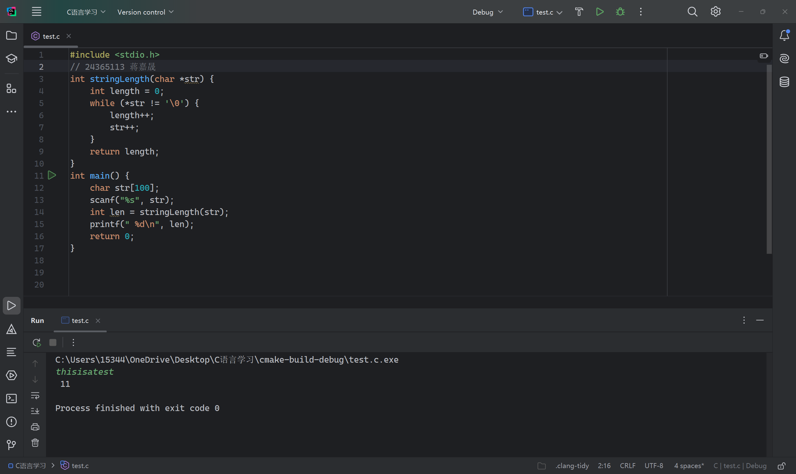
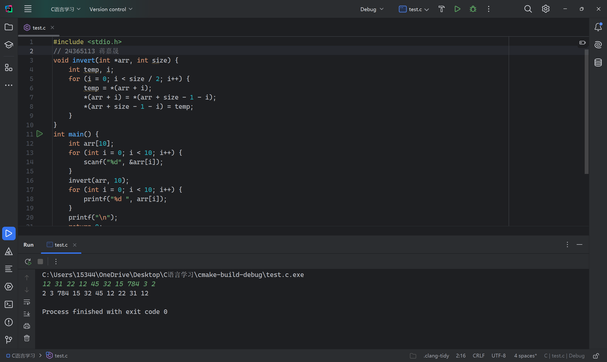
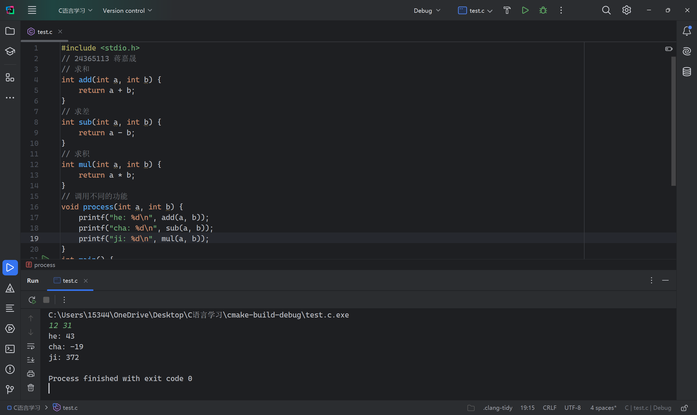

# 实验六 函数 

## 一、实验目的 

1. 掌握定义函数的方法。 
2. 掌握函数实参与形参的对应关系，以及“值传递”的方式。 
3. 掌握函数的嵌套调用和递归调用的方法。 
4. 掌握全局变量、局部变量、动态变量和静态变量的概念和使用方法 
5. 理解和掌握多模块的程序设计与调试的方法。 

## 二、实验准备 
1. 复习函数调用的基本理论知识。 
2. 复习函数的嵌套调用和递归调用的方法。 
3. 复习全局变量、局部变量；静态变量、动态变量；外部变量等概念和具体实用方法。 

## 三、实验内容 
1. 写一函数，求一个字符串的长度。要求： 
本部分习题要求全部用指针完成。 
·在main 函数中输入字符串，并输出其长度。 
·本题不能使用strlen()函数。

2. 编写一个函数，将数组中个数按反序存放。要求： 
·在主函数中输入10个数，并输出排好序的数。 
·编写函数invert(()将 10 个数按反序存放。

 
 
3. 设一个函数，调用它时，每次实现不同的功能： 
·求两个数之和： 
·求两个数之差； 
·求两个数之积。 
要求： 
·在主函数中输入2个数a,b,并输出a,b的和、差和乘积。 
·分别编写函数add()、sub()、mul()计算两个数的和、差、积。 
·编写函数process(),分别调用函数add()、sub()、mul()。

